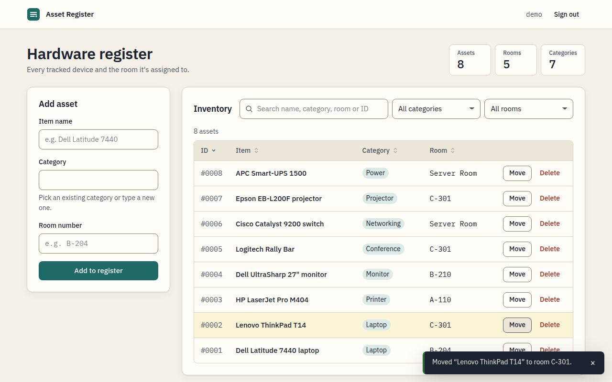
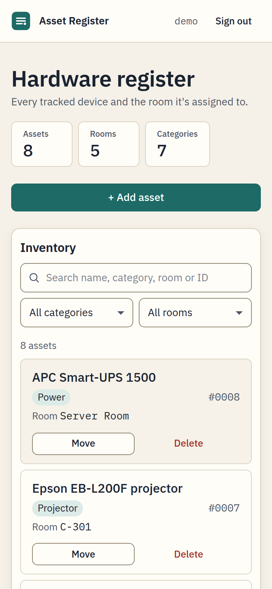
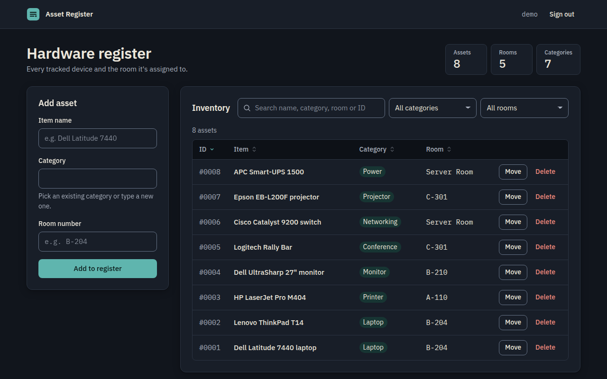

# Asset Register

An internal web app for staff to track office hardware: record a device, see which room it's in, move it to another room, and retire it.

It started as a set of multi-page PHP scripts (kept in [`legacy/`](legacy/)) and has been rebuilt as a React single-page app that talks to a small PHP JSON API backed by MySQL.



**Live demo:** not deployed yet. The app runs locally (see [Getting started](#getting-started)).

> The devices shown in the screenshots are fictional sample data from `server/bin/seed-sample-assets.php`.

## Features

- **Staff sign-in** with server-side PHP sessions and an optional “remember my username” that only pre-fills the form.
- **Route guard:** any API call that returns `401` sends you back to sign-in. An idle session is reported as expired rather than failing silently.
- **Asset register:** add, list, move to another room, and delete devices. Search, filter by category or room, and sort columns.
- **Every state has a screen:** loading skeletons, a slow-connection notice, offline banner, load errors with retry, empty register, no search results, inline field errors and success toasts.
- **Accessible:** keyboard-friendly native dialogs, visible focus, labelled controls, screen-reader announcements, reduced-motion support, and a light/dark palette checked against WCAG AA.
- **Responsive:** the table becomes labelled cards on phones, and the add form collapses behind a button.

<p>
  
  
</p>

## Tech stack

| Layer | Choice |
| --- | --- |
| Client | React 19, React Router 7, Vite 7, plain CSS, self-hosted IBM Plex Sans / Mono |
| API | PHP 8.2+ (no framework), PDO with native prepared statements |
| Database | MySQL 8 or MariaDB 10.6+ (tests run on MariaDB 10.11) |
| Tests | PHP integration suite over real HTTP + MySQL, and a Playwright browser smoke test |

## Project structure

```
client/                 React + Vite app
  src/pages/            Login, Dashboard, Privacy, NotFound
  src/components/       Table, forms, dialogs, alerts, toasts
  src/lib/              API client, auth context, validation, hooks
  e2e/smoke.mjs         Browser smoke test (Playwright)
server/
  public/api/           login.php, logout.php, session.php, assets.php
  src/                  Db, Auth (sessions + CSRF), RateLimiter, Validator, AssetRepository
  database/schema.sql   Tables and indexes
  bin/                  migrate, create-staff, seed-sample-assets
  tests/run.php         API integration tests
  router.php            Serves the API and the built client from one origin
legacy/                 The original multi-page PHP version, for reference
```

## Getting started

Requirements: PHP 8.2+ with `pdo_mysql`, Node.js 20+, and a MySQL 8 (or MariaDB 10.6+) server.

```bash
# 1. Database and config
mysql -u root -e "CREATE DATABASE staff_assets; CREATE USER 'assets_app'@'localhost' IDENTIFIED BY 'choose-a-password'; GRANT ALL ON staff_assets.* TO 'assets_app'@'localhost';"
cp server/.env.example server/.env        # then set DB_PASS
php server/bin/migrate.php

# 2. A staff account (there is no public sign-up; staff are provisioned by an admin)
php server/bin/create-staff.php your.name   # prompts for a password (min 10 chars)

# 3. Optional: fictional sample devices for a quick look
php server/bin/seed-sample-assets.php

# 4. Run it
cd client && npm install
```

**Development** (hot reload). Run these in two terminals:

```bash
php -S 127.0.0.1:8080 -t server/public server/router.php   # API
cd client && npm run dev                                   # http://localhost:5173 (proxies /api)
```

**Production-like build** on a single origin:

```bash
cd client && npm run build && cd ..
php -S 127.0.0.1:8080 -t server/public server/router.php   # http://127.0.0.1:8080
```

## Environment variables

Set in `server/.env` (git-ignored) or as real environment variables. Real environment variables take precedence over the file.

| Variable | Purpose | Default |
| --- | --- | --- |
| `DB_HOST`, `DB_PORT`, `DB_NAME`, `DB_USER`, `DB_PASS` | MySQL connection | `127.0.0.1`, `3306`, `staff_assets`, none, none |
| `SESSION_IDLE_MINUTES` | Inactivity before a session expires | `30` |
| `SESSION_SECURE_COOKIE` | Add the `Secure` flag to the session cookie; set `true` behind HTTPS | `false` |

## API

All endpoints live under `/api/`, accept and return JSON, and respond with `{ "data": … }` on success or `{ "error": { "code", "message", "fields?" } }` on failure.

| Method | Endpoint | Auth | Purpose |
| --- | --- | --- | --- |
| `POST` | `login.php` | No | `{username, password}` → starts a session, returns `{username, csrf_token}` |
| `GET` | `session.php` | Yes | Restores the signed-in user and CSRF token after a reload |
| `POST` | `logout.php` | Yes | Destroys the session (`204`) |
| `GET` | `assets.php` | Yes | All assets: `[{id, item_name, category, room_number}]`, newest first |
| `POST` | `assets.php` | Yes | `{item_name, category, room_number}` → `201` with the new asset |
| `PUT` | `assets.php?id=N` | Yes | `{room_number}` → the updated asset |
| `DELETE` | `assets.php?id=N` | Yes | `204` |

Writes need the `X-CSRF-Token` header. Status codes in use:

- `400`: bad JSON or bad id
- `401`: `UNAUTHENTICATED`, `SESSION_EXPIRED` or `INVALID_CREDENTIALS`
- `403`: CSRF check failed
- `404`: no such asset
- `415`: body is not JSON
- `422`: validation, with per-field messages
- `429`: rate limited, with `Retry-After`

## Security

- Passwords are stored with `password_hash` (bcrypt). Unknown usernames are checked against a dummy hash, so response timing doesn't reveal which accounts exist.
- Every query uses PDO native prepared statements.
- The session cookie is `HttpOnly` and `SameSite=Lax`, and gets `Secure` when `SESSION_SECURE_COOKIE=true`. The session ID is regenerated on sign-in, and idle sessions expire.
- Writes and logout require a per-session CSRF token. JSON-only bodies also block cross-site form posts.
- Rate limits:
  - 20 sign-in attempts per IP every 15 minutes
  - 5 failed attempts per username every 15 minutes
  - per-user limits on reads and writes
- Input is validated on the server, with length limits and a room-number pattern. The client mirrors the same rules.
- Output is escaped by React; the app never uses `dangerouslySetInnerHTML`.
- Clients get generic error messages; details go to the server log only.
- Security headers on both API and pages: CSP, `X-Content-Type-Options`, `Referrer-Policy`, and `frame-ancestors`/`X-Frame-Options`.

See [SECURITY.md](SECURITY.md) to report a vulnerability.

## Testing

```bash
php server/tests/run.php          # 49 API checks against a separate DB (TEST_DB_NAME, default staff_assets_test)
cd client && npm run build        # production build
npm run test:e2e                  # 57 browser checks; needs the app on :8080 and the demo account (see client/e2e/smoke.mjs)
```

The API suite covers auth, CRUD, validation, CSRF, rate limiting, session expiry and SQL-injection and HTML payloads. The browser test covers sign-in, every CRUD flow, the empty, error, offline, slow-network and expired-session states, keyboard focus in dialogs, and horizontal overflow at 375px.

## Migrating from the legacy version

| Legacy script | Now |
| --- | --- |
| `db.php` | `server/src/Db.php` (PDO, config from env instead of hardcoded credentials) |
| `login.php` | `client/src/pages/Login.jsx` + `server/public/api/login.php` |
| `dashboard.php` | `client/src/pages/Dashboard.jsx` |
| `assets/create.php` | `AddAssetForm.jsx` + `POST api/assets.php` |
| `assets/read.php` | `AssetTable.jsx` + `GET api/assets.php` |
| `assets/update.php` | `MoveAssetDialog.jsx` + `PUT api/assets.php` |
| `assets/delete.php` | `DeleteAssetDialog.jsx` + `DELETE api/assets.php` |
| `logout.php` | `AppHeader` sign-out + `POST api/logout.php` |

The legacy scripts stored and compared passwords in plain text and built SQL by string concatenation. Existing rows in a legacy `staff` table won't sign in until each password is reset with `server/bin/create-staff.php <username>`.

## License

[MIT](LICENSE)
